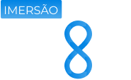

<a href="https://imersao.devopspro.com.br">
   
</a>

# Imersão DevOps && Cloud

Para acessar todas as aulas e lives, acesse: https://imersao.devopspro.com.br/

## Aula 01
Nessa aula você vai aprender os fundamentos de DevOps e como trabalhar com containers utilizando Docker.

O repositório do projeto conversão de temperatura está no link abaixo:

https://github.com/KubeDev/conversao-temperatura

**Links úteis**
Ferramenta Dbeaver para acessar banco de dados:

https://dbeaver.io/download/

## Aula 02
**Passos para subir a aplicação:**
- Primeiro criar o cluster Kubernetes com o K3D fazendo o port bind das 2 portas para a aplicação
``` bash
k3d cluster create meucluster -p "3000:30000@loadbalancer" -p "8080:30001@loadbalancer"
```
- Construir a imagem docker da aplicação chatservice
- Aplicar o manifesto do chatservice
- Aplicar o manifesto do Keycloak 
- Alterar o arquivo host da máquina para adicionar o host keycloak 
- Construir a imagem docker da aplicação webapp
- Aplicar o manifesto da aplicação webapp

**Links úteis**

Link para o DBeaver:

https://dbeaver.io/download/

Link para a plataforma da OpenAI:

https://platform.openai.com/

Link para o postman:

https://www.postman.com/

Caminho do arquivo host nos sistemas operacionais:

Windows - C:\Windows\System32\drivers\etc\hosts

Linux - /etc/hosts

Mac - /etc/hosts

Adicionar a linha abaixo:

127.0.0.1       keycloak

## Aula 03

Template de rede para o EKS do CloudFormations:

https://s3.us-west-2.amazonaws.com/amazon-eks/cloudformation/2020-10-29/amazon-eks-vpc-private-subnets.yaml

## Aula 04

## Aula 05
